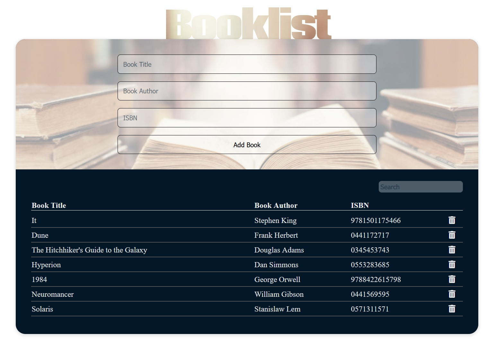

# LearningJS - Booklist
> Simple application for cataloging books built as a practice while learning JavaScript basics.

## Table of contents
* [General info](#general-info)
* [Screenshots](#screenshots)
* [Technologies](#technologies)
* [Live Demo](#live-demo)

## General info
In my learningJS series here on Git Hub I will showcase simple applications built mostly as a practice while learning JavaScript. Here I explore Object Oriented Programming in JavaScript - first I created application using standard (ES5) syntax after which I translated code to ES6 syntax with classes. 

Booklist app enables you to catalog your books - it takes three parameters for each insert - title, author and ISBN. Applicaton stores your list data to Local storage and enables you to manipulate your data - delete items and filter list.

## Screenshots

## Technologies
* Font Awesome - version 5.8.2
* Google Fonts
* Plain JS, CSS3, HTML5

## Live Demo
You can see live demo [here](https://dbilanoski.github.io/learningJS_booklist).